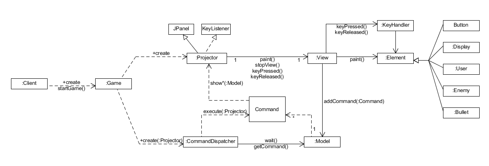

# Bullet-Shooting-Game-JAVA_GUI

> ## 개요
총알을 발사하는 비행기 게임을 ```객체지향적프로그래밍```을 훈련하기 위해 설계부터 구현까지 해보려한다. 
게임의 규모는 객체지향프로그래밍과 클린코드 작성훈련이 목적이기 때문에 가성비를 고려하여 최소화한다. 


> ## 목표
* 깊이 생각하지 않고 짜던 나쁜 코딩버릇을 고치고 클린코드를 짜는 습관을 체화
* 객체지향적인 사고방식 훈련.
* 유지보수를 고려한 설계 훈련.
* 의존성과 결합도, 응집도 관리를 통한 클린코드 작성훈련.
* 시행착오를 통한 JAVA의 OOP 체감.
* 배포를 고려하여 모듈화 훈련.
* 객체의 책임과 위임에 대한 이해와 적용 훈련


> ## 요구사항
* JAVA의 Swing을 이용해서 GUI를 만든다.
* 게임의 조작은 키보드로만 가능하며 방향키로 움직이고 스페이스바 or 'Z'키로 총알 발사가 가능하다.
* 뷰는 메인화면, 캐릭터 선택화면, 게임화면으로 3가지이다. 
* 메인화면에서 게임시작을 하면 캐릭터 선택화면으로 전환되고 캐릭터마다 능력치가 다르다.
* 캐릭터 선택화면에서 캐릭터를 선택하면 게임화면으로 넘어가지고 바로 게임이 시작된다. 
* 게임이 종료되면 메인화면으로 자동으로 가진다.
* 캐릭터 선택화면에서는 각 캐릭터에 포커스를 맞출 시 파워와 유닛의 스피드를 볼 수 있다.
* 각 캐릭터의 life는 3개이고 총알의 갯수 제한은 없다.
* 자신의 캐릭터가 적 유닛의 총알에 맞을 시 약 2초간 유닛이 깜박이며 무적상태가 된다. 
* 스페이스바 또는 'Z'키를 누르고 있으면 연사가 가능하다.
* 캐릭터를 움직이면서 연사를 할 수 있다.
* 적 유닛의 life는 유닛마다 다르고 life가 0이 되면 사라진다.
* 적 유닛은 frame밖으로 벗어나면 없어진다.
* 적 유닛은 일정 시간마다 총알을 발사한다.
* 모든 적 유닛을 없애거나 자신의 캐릭이 3번 총알에 맞게되면 게임은 종료된다.
* 게임이 종료되면 바로 Main화면으로 돌아가진다.


> ## 다이어그램
Game의 다이어그램을 간단히 그려보면 다음과 같다.



> ## 게임 설명
1. 방향키로 유닛의 움직임이나 버튼의 포커스를 조종할 수 있다.
1. SPACE_BAR 또는 Z키를 누름으로써 버튼을 누르거나 총알을 발사 할 수 있다.
1. 총알을 맞으면 캐릭터가 깜박거리며 2초간 무적상태가 된다.
1. 총알을 3번 맞으면 GAME OVER가 되고 자동으로 Main화면으로 돌아간다.
1. 적 유닛들은 유닛의 종류에따라 life가 다를 수 있으며 총알을 맞추어 life를 소진시킬 수 있다.
1. 적 유닛들의 life가 0이 되면 유닛들은 사라지고 화면의 모든 유닛이 사라지면 다음 단계(Next Phase)의 적유닛들이 이어서 나온다.
1. 모든 유닛들을 제거하고 더이사 나올 유닛이 없다면 GAME CLEAR가 되고 자동으로 Main화면으로 돌아간다.


> ## 개발 내용
개발을 하면서 훈련이 되고 배웠던 내용은 내용이 많기에 아래의 블로그에 올린다.
* Blog URL : https://brandpark.github.io/

> ## 게임 화면